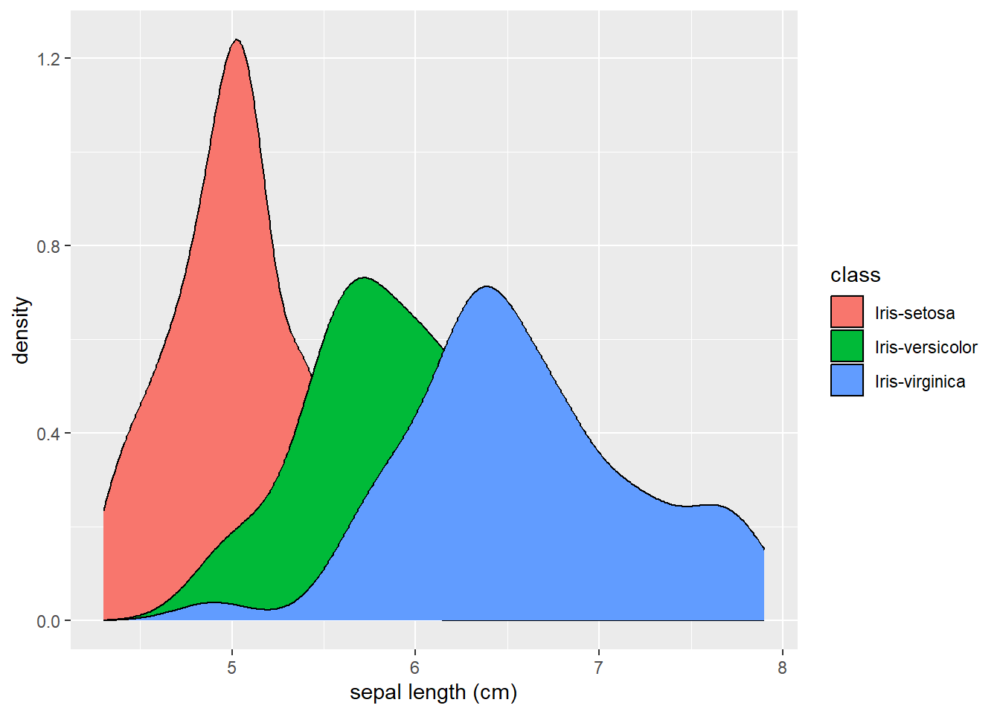

# Introduction
 The [iris dataset](https://archive.ics.uci.edu/dataset/53/iris) is a staple, readily-available dataset often used to introduce the bustling world of data analysis. Containing measurements of 4 continuous and distinct flower features as well as the flower classifications, this dataset provides an approachable medium for breaking into the field.

# Implementation
 In this repository, we use the R programming language to briefly explore the features of the data. More specifically, we examine the distribution of the sepal length (cm) of the flowers per flower type. We do so using ggplot2's density plot.

# Results
 After running our code, we found the following association between the sepal length of the flowers with their respective flower classification:
 

# Contact
 Please send any inquiries to [jlw7204@psu.edu](mailto:jlw7204@psu.edu). Thank you for your time!
